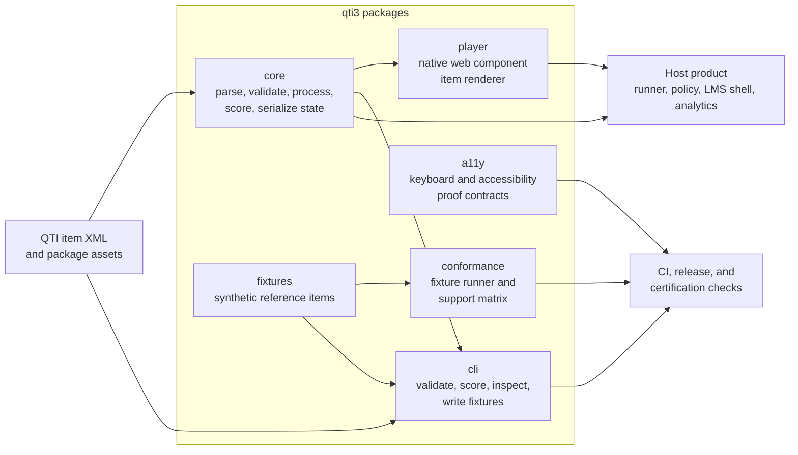
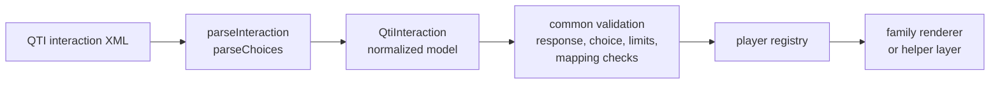

# qti3

`qti3` is a dependency-light, framework-neutral TypeScript reference implementation for
QTI 3 assessment items.

The project ships public releases on npm. The target is a clean, auditable item engine for
parsing, validating, rendering, scoring, serializing, restoring, and testing QTI 3 items
across products. The core stays independent of any UI framework.

This is not another framework-specific item player. The public project focuses on QTI
item and question-type conformance. Host products own runners, controllers, LMS shells,
candidate attempt policy, analytics, proctoring, rostering, and gradebook integrations.

## Project shape

`qti3` is item-focused: the core owns QTI semantics, the player renders one item at a
time, tooling proves conformance and accessibility behavior, and host products own the
surrounding assessment application.



## Interaction families

Most interaction support starts from the same parser, normalized `QtiInteraction` model,
and validation gates. The browser player then routes each interaction to a renderer or
helper family based on response shape and user interaction model.



| Family                     | Interactions                                                             | Shared implementation                                       |
| -------------------------- | ------------------------------------------------------------------------ | ----------------------------------------------------------- |
| Identifier choices         | Choice, Inline Choice, Hot Text, Hotspot                                 | Choice parsing, identifier response checks, choice metadata |
| Ordered choices            | Order, Graphic Order                                                     | Ordered identifier contract and reorder behavior            |
| Pairing and matching       | Associate, Match, Graphic Associate                                      | Source/target choices, token controls, selected pair chips  |
| Gap assignment             | Gap Match, Graphic Gap Match                                             | Source choices assigned to text or graphic gaps             |
| Graphic and coordinate UI  | Hotspot, Graphic Order, Graphic Associate, Select Point, Position Object | Responsive surfaces, object images, hotspot/point placement |
| Text responses             | Text Entry, Extended Text                                                | String response contract and text-entry renderer            |
| File responses             | Upload, Drawing                                                          | File response contract                                      |
| Scalar and host-controlled | Slider, Media, End Attempt, Portable Custom                              | Small specialized renderers and host event bridges          |

## Release goals

Public releases focus on a clean, auditable QTI 3 item engine: conformance evidence,
accessibility evidence, dependency-light host integration, and hardening of the
framework-neutral packages.

See [CHANGELOG.md](CHANGELOG.md) for release-by-release detail about delivered work,
current release notes, compatibility notes, and follow-up goals.

### Still out of scope

These belong in host products, not in the open-source item engine:

- Full assessment-test runner, reusable LMS controller, or test navigation UI.
- Shared stimulus delivery (`S-*`), full test delivery (`T-*`), timing policy, proctoring, analytics, rostering, LTI, and gradebook integration.
- Runtime XSD or schema validation.

## Question-type support

The target is the current public QTI 3 item interaction set described by the
[1EdTech QTI 3 Implementation Guide](https://www.imsglobal.org/spec/qti/v3p0/impl)
with element names from the
[QTI 3 XML Binding](https://www.imsglobal.org/spec/qti/v3p0/bind/) and tracked
internally as the `QTI 3.0.1 ASI item profile`.

In this README, "Supported" has a specific meaning. The interaction must parse into the
typed model, validate against its response and element contract, render in the browser
player, score in the core runtime, ship with a public reference fixture, pass fixture and
conformance tests, include accessibility metadata, and run through browser rendering tests.

| Spec interaction  | QTI element                         | qti3 status             | Evidence                                                                          |
| ----------------- | ----------------------------------- | ----------------------- | --------------------------------------------------------------------------------- |
| Choice            | `qti-choice-interaction`            | Supported               | `choice-reference.xml`; core, fixture, conformance, a11y, browser tests           |
| Text Entry        | `qti-text-entry-interaction`        | Supported               | `textEntry-reference.xml`; core, fixture, conformance, a11y, browser tests        |
| Extended Text     | `qti-extended-text-interaction`     | Supported               | `extendedText-reference.xml`; core, fixture, conformance, a11y, browser tests     |
| Gap Match         | `qti-gap-match-interaction`         | Supported               | `gapMatch-reference.xml`; core, fixture, conformance, a11y, browser tests         |
| Hotspot           | `qti-hotspot-interaction`           | Supported               | `hotspot-reference.xml`; core, fixture, conformance, a11y, browser tests          |
| Hot Text          | `qti-hottext-interaction`           | Supported               | `hottext-reference.xml`; core, fixture, conformance, a11y, browser tests          |
| Inline Choice     | `qti-inline-choice-interaction`     | Supported               | `inlineChoice-reference.xml`; core, fixture, conformance, a11y, browser tests     |
| Match             | `qti-match-interaction`             | Supported               | `match-reference.xml`; core, fixture, conformance, a11y, browser tests            |
| Order             | `qti-order-interaction`             | Supported               | `order-reference.xml`; core, fixture, conformance, a11y, browser tests            |
| Graphic Order     | `qti-graphic-order-interaction`     | Supported               | `graphicOrder-reference.xml`; core, fixture, conformance, a11y, browser tests     |
| Associate         | `qti-associate-interaction`         | Supported               | `associate-reference.xml`; core, fixture, conformance, a11y, browser tests        |
| Graphic Associate | `qti-graphic-associate-interaction` | Supported               | `graphicAssociate-reference.xml`; core, fixture, conformance, a11y, browser tests |
| Graphic Gap Match | `qti-graphic-gap-match-interaction` | Supported               | `graphicGapMatch-reference.xml`; core, fixture, conformance, a11y, browser tests  |
| Media             | `qti-media-interaction`             | Supported               | `media-reference.xml`; core, fixture, conformance, a11y, browser tests            |
| Position Object   | `qti-position-object-interaction`   | Supported               | `positionObject-reference.xml`; core, fixture, conformance, a11y, browser tests   |
| Select Point      | `qti-select-point-interaction`      | Supported               | `selectPoint-reference.xml`; core, fixture, conformance, a11y, browser tests      |
| Slider            | `qti-slider-interaction`            | Supported               | `slider-reference.xml`; core, fixture, conformance, a11y, browser tests           |
| Upload            | `qti-upload-interaction`            | Supported               | `upload-reference.xml`; core, fixture, conformance, a11y, browser tests           |
| Drawing           | `qti-drawing-interaction`           | Supported               | `drawing-reference.xml`; core, fixture, conformance, a11y, browser tests          |
| Portable Custom   | `qti-portable-custom-interaction`   | Supported host contract | `portableCustom-reference.xml`; core, fixture, conformance, a11y, browser tests   |
| Custom            | `qti-custom-interaction`            | Deprecated diagnostic   | Parsed for explicit warning; not a supported runtime target                       |
| End Attempt       | `qti-end-attempt-interaction`       | Supported               | `endAttempt-reference.xml`; core, fixture, conformance, a11y, browser tests       |

For automated review, the same support matrix is available as JSON:

```sh
node packages/cli/dist/index.js support-matrix
```

## Goals

- Implement the latest public QTI 3 item behavior explicitly, tracking QTI 3.0.1 ASI documents where applicable.
- Support all QTI 3 interaction/question types in the target item profile.
- Make scoring and response processing runnable in Node without a browser.
- Provide an accessible, style-neutral web component player that can be embedded in any product.
- Publish a reusable conformance test suite.
- Load QTI package zips and assessment-test item references where useful for item-focused testing.
- Keep dependencies as small as possible.
- Make unsupported or invalid behavior visible through structured diagnostics.

## Non-goals

- The project does not depend on a heavy UI framework such as React or Vue.
- The browser player does not use Lit. Native custom elements keep the surface small.
- The project does not provide a reusable LMS runner or controller. The LMS or harness owns that.
- The project does not handle attempt policy, proctoring, analytics, rostering, gradebook, or LTI integration.
- Production configuration must be explicit. The project should fail fast instead of using hidden fallbacks.
- QTI XML is not compiled as framework templates.
- There is no global singleton state store. Multiple players should not share a brain.
- The runtime does not run XSD or schema validation. Semantic diagnostics stay fast and embeddable.

## Packages

```text
packages/
  core/          # parser, typed model, validation, processing, scoring, state
  player/        # native custom element browser player
  conformance/   # fixture runner and support matrix tooling
  a11y/          # accessibility contracts and automated checks
  fixtures/      # QTI item fixtures and expected outcomes
  cli/           # validation, scoring, fixture, and support-matrix CLI
```

Assessment-test/package support belongs in tooling and examples, and only when it helps
discover, load, and verify item references. The player package renders one item at a time
and exposes state/events for host-owned runners.

The browser player surface is a native web component:

```html
<script type="module" src="/qti3-player.js"></script>
<qti-assessment-item-player id="player"></qti-assessment-item-player>
```

```js
const player = document.getElementById("player");

await player.loadXml(xml, {
  status: "interacting",
  sessionControl: {
    validateResponses: true,
    showFeedback: false,
  },
});

await player.loadUrl("/items/item-1.xml", {
  fetchXml: async (url) => {
    const response = await fetch(url);
    if (!response.ok) throw new Error(`Unable to load ${url}`);
    return response.text();
  },
});

await player.loadXml(packageItemXml, {
  resolveAsset: (url) => packageAssetUrlFor(url),
});

player.addEventListener("qti-statechange", (event) => {
  saveState(event.detail.state);
});

player.addEventListener("qti-responsechange", (event) => {
  console.log(event.detail.responseIdentifier, event.detail.value);
});

player.addEventListener("qti-validation", (event) => {
  console.log(event.detail.validationMessages, event.detail.state);
});
```

`resolveAsset` is a host hook for package or virtual-file environments. The player calls it
for relative `src`, `href`, and `data` asset URLs after rendering the item. Normal
web-served items can omit it. Package-backed media, graphic, and drawing assets should use
this hook so rendered controls and serialized response exports can resolve authored asset
references.

Two response-bearing interactions have format-specific contracts worth calling out:

- `qti-media-interaction` records play experiences as a `single` / `integer` response.
- `qti-drawing-interaction` requires a `single` / `file` response and serializes candidate
  drawings as image file data URLs.
- `qti-portable-custom-interaction` supports the Portable Custom Interaction (PCI) host
  contract: parsing and validating launch metadata, interaction markup, template/context
  bindings, stylesheets, catalog info, opaque suspend/resume state, and response/state
  events. The player exposes a `qti3-portable-custom-host` element with small launch
  metadata and emits `qti-portable-custom-mount` with the full parsed definition so a
  host-provided PCI runtime can attach the module. Production module loading, sandboxing,
  CSP, tenant allowlists, and audit policy remain host responsibilities.

## Styling

The browser player is style-neutral by design. It ships only the structural styles needed
for layout, focus visibility, forced-colors support, and accessible interaction behavior.
Product typography, spacing, borders, colors, and surrounding chrome belong to the host
application.

The player renders in light DOM, so host CSS can style it directly:

```css
qti-assessment-item-player {
  font:
    16px/1.5 system-ui,
    sans-serif;
  color: #1f2937;
}

qti-assessment-item-player .qti3-interaction {
  margin-block: 1rem;
}

qti-assessment-item-player .qti3-choice-option[data-selected="true"] {
  border-color: currentColor;
}
```

Rendered elements use `qti3-*` class names for player structure, such as
`qti3-player`, `qti3-item-body`, `qti3-interaction`, and interaction-specific classes
like `qti3-choice`, `qti3-textEntry`, and `qti3-hotspot`. Authored QTI shared-vocabulary
classes that start with `qti-` are preserved on rendered interactions where applicable.

QTI shared vocabulary classes are authoring hints defined by the specification, not
product theme classes. Classes such as `qti-labels-none`,
`qti-labels-decimal`, `qti-input-control-hidden`, and `qti-unselected-hidden` describe
portable item-level presentation preferences. `qti3` preserves those classes so host
products can reflect the item author's choices while still applying their own visual system.
The machine-readable support matrix is the source of truth for shipped shared vocabulary
coverage. Inspect the `sharedVocabularyClasses` section for each class name, scope,
interaction surface, support level, fixture evidence, and test evidence:

```sh
node packages/cli/dist/index.js support-matrix
```

See the 1EdTech
[QTI 3 Standardized Shared Vocabulary and CSS Classes](https://www.imsglobal.org/node/218713)
document for the normative shared vocabulary and example CSS.

Framework adapters may be added later, but they should wrap the web component or core API.
They must not own the QTI implementation.

The initial player should use native custom elements directly. Lit is not part of the
initial stack and should come back into scope only if plain custom element code creates a
maintenance problem that outweighs the dependency and abstraction cost.

## Platform

- ESM-only packages.
- Node.js 22+.
- Modern browsers.
- Deno 2+.
- Light DOM for the default player, rendered into the page DOM so host CSS and tooling can inspect and style it directly.

## Tooling choices

- TypeScript 6+
- pnpm
- Vite 8+
- Vitest
- Playwright
- axe-core
- oxfmt
- oxlint

## Checks

Every change should pass the same checks locally and in CI:

```sh
pnpm format:check
pnpm lint
pnpm typecheck
pnpm test
pnpm test:conformance
pnpm test:a11y
pnpm check:deps
pnpm build
pnpm check:maps
pnpm check:exports
pnpm test:browser
```

The publish gate is the release check:

```sh
pnpm release:check
```

`pnpm release:check` uses the public fixture set, browser coverage, support metadata,
package exports, and built CLI fixture runner. It does not require official 1EdTech
certification artifacts.

The certification-oriented gate is available separately:

```sh
QTI3_EXTERNAL_QTI_DIR=/path/to/official/qti \
QTI3_EXTERNAL_VALIDATOR_REPORT=/path/to/validator-report.json \
pnpm certification:check
```

`pnpm test:external` remains optional for local development and skips when
`QTI3_EXTERNAL_QTI_DIR` is not configured. `pnpm test:external:required` and
`pnpm certification:check` fail fast unless official external QTI content and a
non-empty validator report artifact are provided.

The browser harness is available with:

```sh
pnpm dev
```

From a source checkout, run `pnpm build` before using the built CLI entry point.
Published packages expose the same commands through the `qti3` binary.

The CLI can parse local QTI directories, including external reference sets:

```sh
node packages/cli/dist/index.js parse-dir /path/to/items
```

Use validation when diagnostics should fail the command:

```sh
node packages/cli/dist/index.js validate-dir /path/to/items
```

It can also score each item by applying its declared correct responses:

```sh
node packages/cli/dist/index.js score-correct-dir /path/to/items
```

Delivery-safe XML generation and server-style scoring are library APIs in `0.5.x`.
Dedicated CLI commands for those operations are planned separately, not shipped in this
release line.

For package-level inspection without creating an open-source runner, use:

```sh
node packages/cli/dist/index.js inspect-package /path/to/package.zip
```

This enumerates XML files, assets, manifest/test item references, and parse diagnostics
for loadable assessment items.

Use strict package validation for conformance-oriented package checks:

```sh
node packages/cli/dist/index.js validate-package /path/to/package.zip
```

Strict package validation requires `imsmanifest.xml`, requires manifest or
assessment-test item references, and fails direct item XML files that are not referenced
by the package metadata.

It can also write standalone canonical reference items for targeted interactions,
processing patterns, and adaptive behavior:

```sh
node packages/cli/dist/index.js write-fixtures packages/fixtures/xml
```

The support matrix is machine-readable. It includes evidence for supported interactions,
deprecated interactions, processing elements, and shared vocabulary classes:

```sh
node packages/cli/dist/index.js support-matrix
```

The accessibility proof matrix is also machine-readable. It lists each interaction's role,
keyboard contract, automated evidence, and manual assistive-technology scripts:

```sh
node packages/cli/dist/index.js a11y-proof
```

The release bar is:

- Supported interactions need parser, validation, scoring, rendering, keyboard, and accessibility evidence.
- Accessibility checks cover real operation as well as automated scans.
- Dependencies stay small, exact, and reviewed.
- Published packages use explicit npm `files` allowlists so package contents stay small and deliberate.
- Release checks must pass before publishing; certification evidence remains a separate
  future gate.

## Attempt State

Serialized attempt state uses `qti3.attempt-state.v1`. It captures responses, outcomes,
generated template values, validation messages, lifecycle status, and QTI's built-in
`completionStatus` outcome. PCI suspend/resume data is stored as opaque JSON under
`interactionStates` keyed by response identifier.

- Hosts can save, restore, and review attempts through this state contract.
- Hosts can check restored JSON with `isQtiAttemptStateV1()` or `assertQtiAttemptStateV1()`.
- Non-adaptive items reset authored outcomes before each scoring run.
- Adaptive items retain outcome values across response-processing runs.
- For non-adaptive items, `endAttempt()` completes the item after a valid score run.
- For adaptive items, `endAttempt()` runs response processing and leaves the item open unless processing sets `completionStatus` to `"completed"`.
- Templated items restore saved template values before deriving generated correct responses, so resume does not require the original random seed.

## Coverage

`qti3` includes public synthetic fixtures for every current, non-deprecated QTI 3 item
interaction. The fixtures cover response shape, scoring, browser rendering, keyboard
operation, and accessibility evidence.

Processing coverage includes response processing, template processing, feedback, printed
variables, MathML/template variables, catalogs, shared CSS vocabulary, advanced
numeric/container/point expressions, and adaptive `completionStatus` behavior.

The manual harness exposes debugger panels for responses, outcomes, template values,
diagnostics, validation messages, serialized state, package item navigation, action
history, and accessibility proof scripts.

Package and assessment-test support is item-focused: discovery, item-reference traversal,
asset resolution, validation, and item loading. A full runner/controller remains a host
product concern.

## Publishing

Packages publish under the `longsightgroup` npm organization:

- `@longsightgroup/qti3-core`
- `@longsightgroup/qti3-player`
- `@longsightgroup/qti3-player-preact`
- `@longsightgroup/qti3-player-react`
- `@longsightgroup/qti3-fixtures`
- `@longsightgroup/qti3-conformance`
- `@longsightgroup/qti3-a11y`
- `@longsightgroup/qti3-cli`

Releases publish from the `longsightgroup/qti3` repository after `pnpm release:check`
passes. Package tarballs come from the same checked build output that CI verifies.

## Certification

The project is not currently certified. We plan to pursue relevant QTI certification once
the implementation, fixtures, conformance tests, and public API are stable enough for
review. The `certification:check` script is intentionally strict so certification work
cannot pass without official 1EdTech external content and validator evidence.
